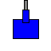

# TroubleTanks

A Windows-based multiplayer tank battle game implemented in C++ with Win32 API, GDI+, and Winsock2.

## Features

- **Multiplayer Networking**: Peer-to-peer networking using TCP sockets
- **Procedural Mazes**: Random maze generation for each game
- **Physics Engine**: Tank movement, shooting, and bullet bouncing
- **Cross-Platform Build**: Supports Visual Studio, MinGW, CMake, and Docker

## Quick Start

1. Clone the repository
2. Choose your preferred build method:
   - **Visual Studio**: Open the solution and build
   - **MinGW**: Run `scripts/build_mingw.bat`
   - **CMake**: `cmake -B build && cmake --build build`
3. Run the generated `TroubleTanks.exe`

## Documentation

- [BUILDING.md](BUILDING.md) - Quick build instructions
- [VISUAL_STUDIO_SETUP.md](VISUAL_STUDIO_SETUP.md) - Detailed Visual Studio setup
- [DOCKER_BUILD.md](DOCKER_BUILD.md) - Docker build instructions
- [CONTRIBUTING.md](CONTRIBUTING.md) - Contribution guidelines

## Controls

### Player 1 (Green Tank)
- **Movement**: Arrow Keys
- **Shooting**: Spacebar

### Player 2 (Red Tank)
- **Movement**: W, A, S, D
- **Shooting**: E

## License

This project is licensed under the MIT License - see the [LICENSE](LICENSE) file for details.